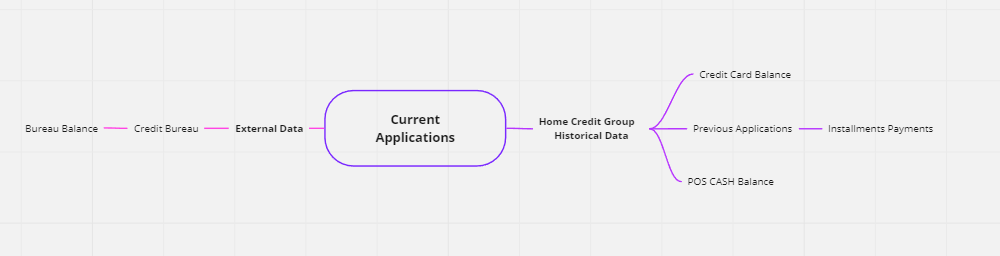
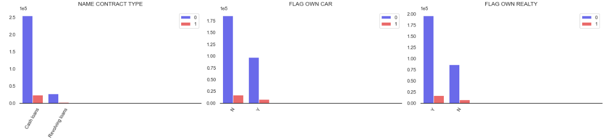
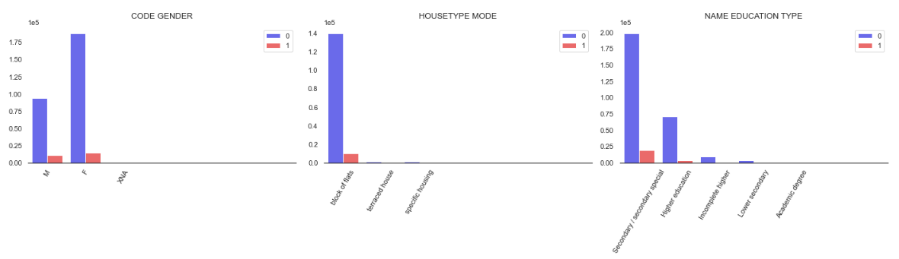
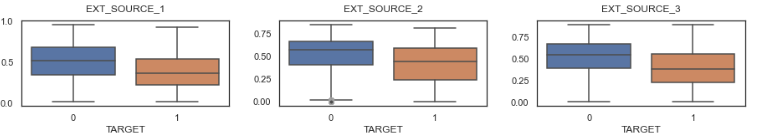
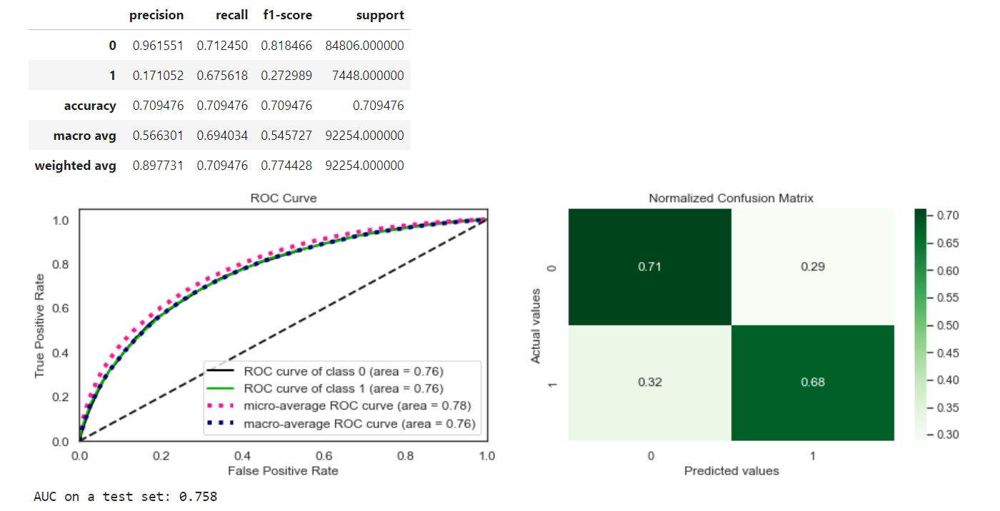
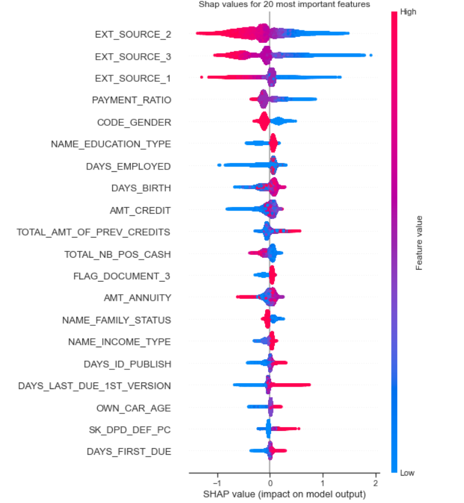

# Prediction of Problematic Loans 💸

This project uses data from Home Credit Group to predict whether a borrower is likely to pay back a loan or default on it. The dataset was highly imbalanced, so I used various techniques to address this issue. I also incorporated external data to improve the accuracy of my models. After testing multiple machine learning models, I chose the best performing one and deployed it using FastAPI and GCP. My model can be used to identify high-risk borrowers and improve lending practices to minimize default rates.

## **1.0 Business Problem 💼**

What the problematic loans are and why dealing with them is necessary?

Problematic loans: 
-  where repayment, as per the terms of the credit agreement, is in doubt
-  a loan, where the ability to recover outstanding principal (in the event of deliquency) is in doubt

As an example, in US, federal regulators use two categories to 'risk grade' problem loans:
- criticized - exhibit some weakness in safety or soundness (weak DSCR, high leverage, poor liquidity) but loan is still performing - payments are current
- classified: 1) substandard - either 'unsafe' or 'unsound' meaning inadequate DSCR or collateral coverage or 2) doubtful loans - both 'unsafe' and 'unsound'; loan loss is likely with doubtful credits.

Problem Loans present many unique challenges for a financial institution.

Problem loans generally make up a small proportion of a bank's total credit outstanding, but they take up significant time and resources.

## **2.0 GOAL: build a model for predicting problematic loans 🎯**

*Why*: you can see when a customer or prospect account might pay late when some early signs occure - change credit decision/early reaction and contact with the client

*What is it*: model that quantitatively estimate the probability that customer display a specific behaviour

*How it works*: model predits if a borrower will repay a loan or not. It takes into account factors such as payment history, credit card history, behavioral data.

*What are the benefits*: reduced risk of high-risk accounts; increased speed, scale and efficiency.

*What are the limitations*: lack of personalization, limited data, inability to predict new environmental events.

## **3.0 Solution Strategy 🛠**

**Step 1**: EDA to check what kind of data I deal with – internal/external data; current applications for credits, previous credit history; borrower characteristics: This is and important step to gain an understanding of the dataset and the variables involved. This helps to identify any data quality issues, missing values, and potential correlations between variables.

**Step 2**: Feature engineering with feature-engine library: Feature engineering is the process of transforming raw data into features that are suitable for machine learning models. The feature-engine library provides a set of tools for this process, including imputation of missing values, encoding categorical variables, and scaling numerical variables.

**Step 3** Build classes for data preprocessing and models: Organizing the code into classes allows for easier management and reuse of code. Preprocessing classes contain the steps for data cleaning and feature engineering, while model classes contain the machine learning models used for prediction.

**Step 3**: RandomizedSearchCV for hyperparameter tuning: Hyperparameters are the settings for machine learning models that are not learned from the data. RandomizedSearchCV is used to search for the best hyperparameters by randomly sampling from a defined search space.

**Step 4**: Boruta feature selection technique: Boruta is a feature selection technique that can identify important features even in the presence of noise and correlated features. This helps to reduce the dimensionality of the dataset and improve the performance of machine learning models.

**Step 5**: Feature importance with shap library: The shap library is used to calculate feature importance for machine learning models. This helps to identify the most important features that are driving the predictions.

**Step 6**: Building Docker image: Docker is used for containerization, which makes it easy to deploy the application in different environments and ensures that the application will run consistently across different systems.

**Step 7**: FastAPI and GCP for deployment: FastAPI is a Python web framework for building APIs, while GCP (Google Cloud Platform) is a cloud computing platform that provides infrastructure for deploying and scaling applications. Using these tools together enables easy deployment and scaling of the machine learning model.

**Step 8**: Locust for testing: Locust is a load testing tool that can simulate user behavior and test the performance of the application under different levels of load. This helps to identify any performance issues before the application is deployed to production.

## **4.0 Top Data Insights 📈**

Datasets available, provided by Home Credit Group and their connections:

People who applied for a loan, mostly applied for cash loans. Most of them did not own a car, but they did own a realty. 2/3 of the borrowers were women, living in block of flats. Most of people finished secondary school or have higher education.

In terms of features, for which distribution od the data differs significantly between people who had payment problems and who did not, values from external sources 1-3 seems to have the highest impact.

## **5.0 Best Machine Learning model - results 🏆**

Best performing model, after hyperparameter tuning was: **XGBOOST**, with parametrs:

>(
>objective="binary:logistic",
>    scale_pos_weight=11.4,>
>    random_state=0,
>    **{
>        "subsample": 0.9,
>        "reg_lambda": 10,
>        "reg_alpha": 0.001,
>        "n_estimators": 50,
>        "max_depth": 5,
>        "learning_rate": 0.2,
>        "colsample_bytree": 1.0,
>    }
>)

Top 20 most important features with highest SHAP values:

## **6.0 Business considerations 👩‍💼**

According to my simulation, if we replace the current model, which predicts bad loans with a 60% true positive rate, with my solution that predicts bad loans with a 68.7% true positive rate, we could minimize the loss from bad predictions by about 19%, from 12.4 million with the current solution to 10.1 million with my solution. 

Additionally, by alerting predictions with pred_proba of class 0 ranging from 0.5 to 0.65 based on my model, we could potentially minimize loss by another 5 million. 

## **7.0 Final remarks ✅**

Overall, my investigation suggests that my solution could improve the current model's performance, resulting in significant cost savings. 

However, further experimentation and refinement of the model may be necessary to achieve even better results. 

Deployment capabilities: 
> ● Testing with basic python script that sends request to ML model’s API endpoint:
> 
> Response time in ms: Median: 118.0 
> 
> 95th percentile: 140.1 Max: 21902 
> 
> ● Testing with Locust: 100 users/swarn rate-2: 
>
>Median: 480 
>
>95th percentile: 5100 Max: 5218 
>
>current failures: 21.4
